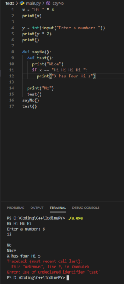

### IodinePY (Not Final Name)
IodinePY is not going to be the Final Name of this because someone else already has a series of Interpreters and Compiles with the name Iodine.
This person you can find on repl.it called CSharpIsGud or Star Trek on Discord -> https://repl.it/@CSharpIsGud

### About

This is a Python interpreter made in C++. Now obviously its not going to be as faster as the original C interpreter but I just wanted to make one.

### How it Looks

This is how it looks:

Looks "similar" to the python3 interperter with the traceback. But it isn't too useful / meaningful yet

### What it can and can't do / TODO

#### What it Can
- [x] Strings
- [x] Variables
- [x] Functions
- [x] Function Calls
- [x] Built-in Native C++ functions
- [x] Return values / Return from function
- [x] Integers
- [x] If statements (Somewhat)
- [x] Errors - Not to useful though
- [x] Implicit Type Conversion
- [x] Explicit Type Conversion (Str and Int rn)

#### What it Can't
- [ ] Booleans
- [ ] Floating Point (AKA doubles)
- [ ] Lists
- [ ] Dictionaries
- [ ] For / While Loops
- [ ] Import / Import from
- [ ] Docstrings
- [ ] Types
- [ ] Properties
- [ ] Classes
- [ ] Decorators